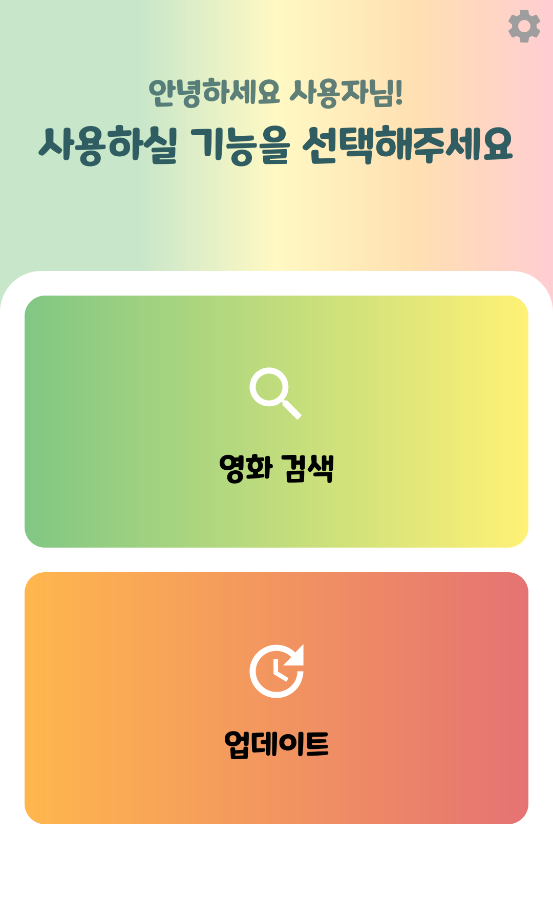
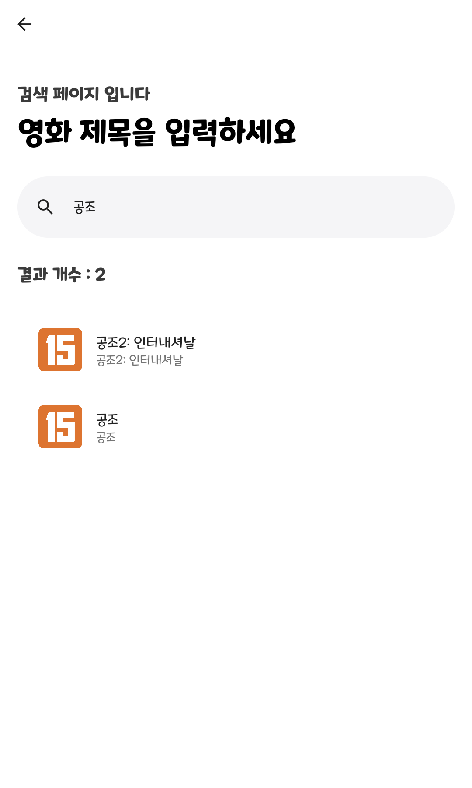
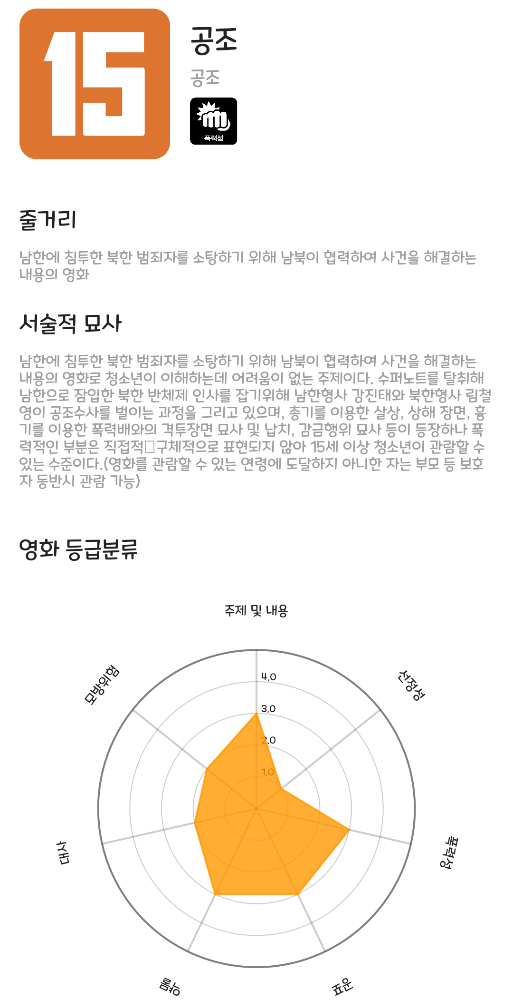

# 아이의 영화

  

## 개요
제11회 문화데이터 활용 경진대회 출품작 입니다.

### 앱 설명
아이들과 영화 관람 전 필수 사용 앱! 아이의 영화

아이와 함께 영화를 볼 때, 영화의 폭력성, 선정성, 언어의 수위 등이 아이에게 적합한지 판단하는 것이 중요합니다.

아이의 영화는 영화의 관람 등급, 등급 분류 별 관람 등급, 줄거리, 서술적 묘사 등을 한눈에 볼 수 있도록 정보를 제공하여 부모가 아이와 함께 볼만한 영화인지 판단하는 것을 도와줍니다.

### 다운로드
앱의 원활한 사용을 위해서는 아래의 링크에서 다운받아 사용해주세요.

(DB, lottie file, image file 등이 repo에 존재하지 않아 앱 사용이 불가합니다.)

[구글 플레이 링크](https://play.google.com/store/apps/details?id=com.child_movie.child_movie)

## 사용 사진
각각 메인 화면, 검색 화면, 영화 정보 화면, 업데이트 화면입니다.

  
 

  

## 기능
기능은 크게 영화 검색 기능과 영화 정보 업데이트 기능이 존재합니다.

### 1. 영화 검색
영화를 검색합니다.

영화 제목으로 영화를 검색합니다. 검색된 영화를 클릭하면 영화의 정보들을 확인할 수 있습니다. 
(사진 아래에도 정보가 더 있지만 짤림)

### 2. 영화 정보 업데이트
영화 정보를 업데이트 합니다.

업데이트 버튼을 클릭하면 Firestore의 저장소에서 최신 영화 데이터를 가져와 내부 DB를 업데이트 합니다.

## 라이센스
The code of **ChildMovie** is [MIT-licensed](LICENSE)
